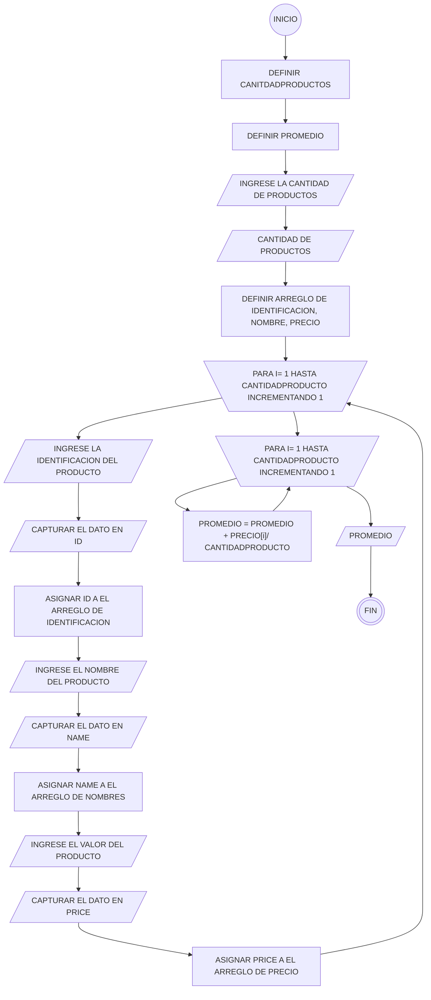

#CALCULADOR DE PROMEDIO DE VENTAS
***
 En su labor como programador de software ha sido elegido para el desarrollo de una aplicación que necesita un ferretero, que desea calcular el promedio de 3 (tres) productos de la ferretería en un periodo determinado. Esta ferretería tiene una buena rotación de productos. Como información básica de cada producto se debe registrar el código de identificación, su nombre y el valor de venta.
\
**Aclaraciones:**
1. Se supondrá que la aplicación solo se requiere para calcular el promedio de un único periodo especifico. 
2. Para efectos de mantener la simplicidad del ejemplo no se contemplan manejar persistencia en el almacenamiento de los datos. 
3. No se realiza validación, ni se verifica calidad en los datos ingresados 

**Historia de usuario**
\

***
##CALCULADOR DE PROMEDIO DE VENTAS

***
## CASO DE USO

**Nombre:** Calculador del Promedio de ventas
\
**Actores:** Ferretero
\
**Propósito:** Guardar identificación, nombre, precio
\
**Curso Normal de Eventos:**
1. El Ferretero ingresa la cantidad de productos a evaluar.
2. El Ferretero ingresa la identificación, nombre, curso, y el valor del producto.
3. Se calcula el promedio a partir de:
( Σ(Precio del producto 1, Precio del producto 2, Precio del producto 3, Precio del producto n) / Total ventas) / Cantidad productos
4. Se Muestra el promedio de las ventas obtenidas
Postcondiciones: Promedio de ventas 

***
##Aproximación Seudocódigo
\
 Algoritmo Ferreteria
 
	Definir CantidadProductos Como Entero
	Definir promedio como real
	Escribir "INGRESE LA CANTIDAD DE PRODUCTOS A EVALUAR"
	Leer CantidadProductos
	Dimension  identificacion[CantidadProductos], nombres[CantidadProductos]
	Dimension  precio[CantidadProductos]		
	Para i=1 Hasta CantidadProductos Con Paso 1
		Escribir "INGRESE LA IDENTIFICACION DEL PRODUCTO " ,i
		Leer id
		identificacion[i] = id
		Escribir "INGRESE EL NOMBRE DEL PRODUCTO " ,i
		Leer name
		nombres[i] = mame
		Escribir "INGRESE EL VALOR DE VENTA DEL PRODUCTO " ,i
		Leer price
		precio[i] = price
	FinPara
	Para i=1 hasta CantidadProductos con paso 1
		promedio = promedio + precio[i] / CantidadProductos
				
	finPara
	
	Imprimir "El promedio de ventas es: ",promedio	
FinAlgoritmo
***

