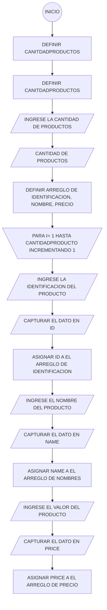

#CALCULADOR DE PROMEDIO DE VENTAS
***
 En su labor como programador de software ha sido elegido para el desarrollo de una aplicación que necesita un ferretero, que desea calcular el promedio de 3 (tres) productos de la ferretería en un periodo determinado. Esta ferretería tiene una buena rotación de productos. Como información básica de cada producto se debe registrar el código de identificación, su nombre y el valor de venta.
\
**Aclaraciones:**
1. Se supondrá que la aplicación solo se requiere para calcular el promedio de un único periodo especifico. 
2. Para efectos de mantener la simplicidad del ejemplo no se contemplan manejar persistencia en el almacenamiento de los datos. 
3. No se realiza validación, ni se verifica calidad en los datos ingresados 

**Historia de usuario**

\
#CALCULADOR DE PROMEDIO DE VENTAS
\

